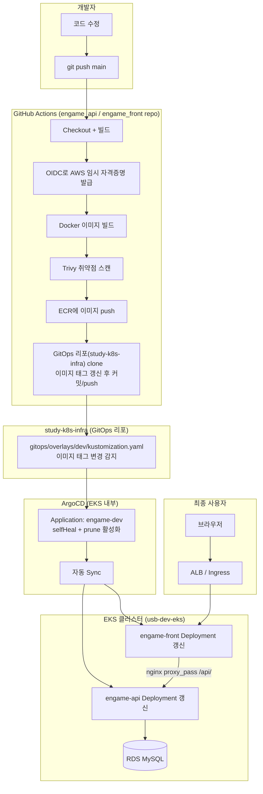
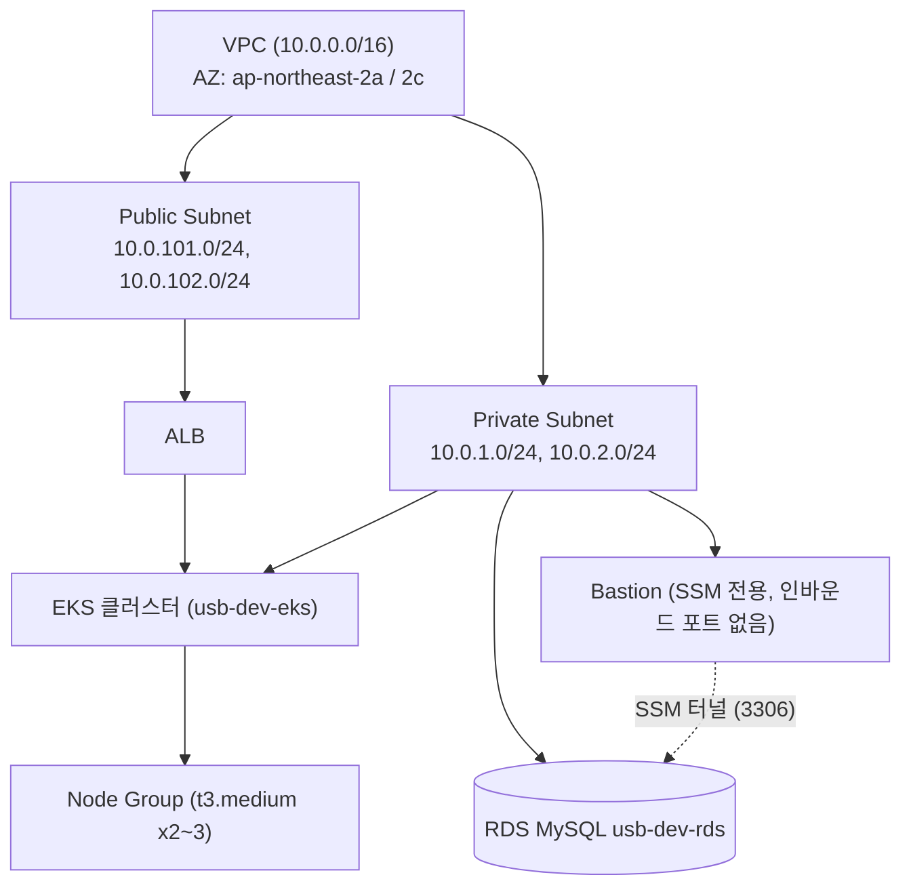

# 전체 아키텍처 & 파이프라인 큰 그림

이 문서는 세부 설정값보다 **"전체가 어떻게 맞물려 돌아가는가"**에 집중합니다. 각 설정의 상세 값과 재현 명령어는 [`SETUP_DETAIL.md`](SETUP_DETAIL.md)를 참고하세요.

---

## 1. 한 장으로 보는 전체 그림



**핵심 원칙 한 줄 요약**: "이미지를 새로 빌드해서 ECR에 올리는 것"과 "실제로 클러스터에 배포되는 것"은 완전히 분리된 별개의 이벤트이고, 이 둘을 이어주는 유일한 다리는 **GitOps 리포(`study-k8s-infra`)의 매니페스트 변경**입니다. ArgoCD는 ECR을 쳐다보지 않고, 오직 Git 상태만 봅니다.

---

## 2. 레이어별 구조

### 2-1. 인프라 레이어 (Terraform, `terraform/`)



- **VPC**는 public(ALB용)/private(연산 자원용) subnet을 분리한 표준 2-tier 구조.
- **Bastion**은 SSH가 아니라 **SSM Session Manager 전용**이라 인바운드 포트가 아예 없음 — 이 자체가 하나의 보안 설계 포인트 (공격 표면 최소화).
- **RDS**는 완전히 private에 있어서 Bastion을 통한 SSM 포트포워딩으로만 로컬에서 접근 가능.
- **ECR**은 VPC 밖(AWS 계정 레벨 리소스)이라 이 다이어그램엔 없지만, EKS 노드가 이미지를 pull하는 대상.

### 2-2. GitOps / 배포 레이어

```
study-k8s-infra
├── gitops/argocd/engame-dev-application.yaml   ← ArgoCD가 "뭘 감시할지" 정의
├── gitops/base/                                  ← 공통 K8s 리소스 정의 (템플릿)
└── gitops/overlays/dev/kustomization.yaml        ← dev 환경 실제 값 (이미지 태그 등)
```
- `base/`는 "이 앱이 어떻게 생겼는지"의 뼈대 (Deployment, Service, Ingress 구조)
- `overlays/dev/`는 "지금 dev 환경에 실제로 뭘 배포할지" (namespace, 이미지 태그) — **CI가 자동으로 고쳐쓰는 부분이 바로 여기**
- 나중에 `overlays/prod/`를 추가하면 같은 `base/`를 재사용하면서 환경별 차이만 얹는 구조로 확장 가능 (Kustomize의 핵심 설계 의도)

### 2-3. CI 레이어 (GitHub Actions)

두 저장소(`engame_api`, `engame_front`) 모두 동일한 패턴:
```
push to main
  → id-token: write 권한으로 OIDC JWT 발급받음
  → configure-aws-credentials가 이 JWT를 AWS STS에 제시 → 임시 AWS 자격증명 획득
  → 이 자격증명으로 ECR 로그인/push, GitOps 리포 접근(는 별도 GITOPS_REPO_TOKEN 사용)
```

**왜 액세스 키 대신 OIDC인가**: 장기 액세스 키를 GitHub Secrets에 박아두면 유출 시 무제한 유효한 자격증명이 새는 것과 같습니다. OIDC 방식은 매 실행마다 GitHub가 서명한 JWT를 AWS가 검증해서 그때그때 짧은 수명의 임시 자격증명만 발급하므로, 키 유출 자체가 구조적으로 불가능합니다. (AWS/GitHub가 현재 공식 권장하는 방식)

**왜 두 개의 서로 다른 인증 수단을 쓰는가**:
| 대상 | 인증 수단 | 이유 |
|---|---|---|
| AWS (ECR push) | GitHub OIDC → IAM Role | 액세스 키 불필요, 리포지토리 단위로 세밀하게 신뢰 범위 제한 가능 |
| GitHub (GitOps 리포 push) | PAT (`GITOPS_REPO_TOKEN`) | GitHub 저장소 간 push는 OIDC로 대체할 표준 수단이 아직 일반적이지 않아 PAT 사용 (GitHub App으로 대체하면 더 안전하지만 지금은 PAT) |

---

## 3. "push 한 번" 이 실제로 무슨 일을 일으키는가 — 스텝별 상세 시나리오

`engame_api`에 코드를 고치고 `git push origin main`을 실행했다고 가정합니다.

1. **트리거**: `.github/workflows/ci-cd.yml`의 `on: push: branches: [main]` 조건에 걸려 워크플로가 즉시 시작됨. 사람이 버튼을 누르는 과정 없음.
2. **빌드**: `./mvnw -B package -DskipTests`로 jar 생성 (테스트는 스킵 — [`SETUP_DETAIL.md` 13-11] 개선 여지 있음).
3. **AWS 인증**: `configure-aws-credentials@v4`가 `role-to-assume: github-actions-engame-deploy`로 OIDC 인증 → 임시 자격증명 확보.
4. **이미지 빌드 & 태깅**: `docker build -t <ECR_REGISTRY>/<ECR_REPOSITORY>:<github.sha>` — **태그가 항상 커밋 sha**라는 게 중요 포인트 (뒤에서 설명).
5. **Trivy 스캔**: OS 패키지 + jar 안의 Java 라이브러리(jackson, spring, tomcat 등)까지 스캔. 지금은 `exit-code: 0`이라 뭘 찾아도 다음 단계로 그냥 진행됨.
6. **ECR push**: 이미지가 `usb-dev-engame-api` 리포지토리에 새 태그로 올라감. **이 시점까지는 클러스터에 아무 변화도 없음.** ECR에 이미지가 하나 더 쌓인 것뿐.
7. **GitOps 리포 갱신**: `GITOPS_REPO_TOKEN`으로 `study-k8s-infra`를 clone → `yq`로 `gitops/overlays/dev/kustomization.yaml`의 `engame-api` 이미지 `newTag`를 방금 만든 sha로 고침 → 커밋 → push. **여기서 처음으로 "배포 의도"가 Git에 기록됨.**
8. **ArgoCD 감지**: ArgoCD `Application(engame-dev)`이 `study-k8s-infra`의 `gitops/overlays/dev` 경로를 주기적으로/webhook으로 감시하다가, 커밋으로 인해 원하는 상태(desired state)가 바뀐 걸 발견.
9. **자동 Sync**: `syncPolicy.automated`가 켜져 있어서 사람 개입 없이 즉시 sync 시작. `kustomize build`로 최종 매니페스트를 렌더링하고, 실제 클러스터 상태와 diff해서 `engame-api` Deployment의 이미지 필드만 바뀐 걸 적용.
10. **Kubernetes 롤아웃**: Deployment 컨트롤러가 새 이미지로 새 ReplicaSet을 만들고, 기존 파드를 순차적으로 교체. **이 시점에 실제로 새 코드가 서비스에 반영됨.**
11. **(문제 발생 시) selfHeal**: 만약 누군가 `kubectl edit`로 클러스터를 수동으로 고치면, ArgoCD가 이를 감지해서 다시 Git 상태로 되돌림 (`selfHeal: true`) — 즉 **Git이 유일한 진실의 원천(Single Source of Truth)**이 되도록 강제함.

---

## 4. 왜 이렇게 설계했는가 (설계 결정과 이유)

| 결정 | 이유 |
|---|---|
| 앱 저장소와 GitOps 저장소 분리 (`engame_api`/`engame_front` vs `study-k8s-infra`) | 앱 코드 변경 권한과 "클러스터에 무엇을 배포할지 결정하는 권한"을 분리. CI 파이프라인이 뚫려도 클러스터 배포 상태에 직접 `kubectl apply`할 순 없고, 오직 GitOps 리포에 커밋하는 것까지만 가능 |
| 이미지 태그로 `latest` 대신 `github.sha` 사용 | `latest`를 쓰면 태그 문자열이 안 바뀌니 ArgoCD가 변경을 감지 못하고, 롤백도 불가능해짐. sha 태그는 배포 하나하나가 특정 커밋과 1:1 매핑되어 추적/롤백이 명확해짐 |
| Trivy (오픈소스) vs Black Duck (상용) | Black Duck은 서버/라이선스/토큰이 필요한 유료 SaaS라 이 프로젝트 규모에 안 맞음. Trivy는 액션 하나로 서버 없이 즉시 동작하고, OS+애플리케이션 의존성 둘 다 스캔 가능해서 채택 |
| AWS 인증에 OIDC (액세스 키 대신) | 장기 자격증명을 저장소 시크릿에 두지 않아도 됨 → 유출 리스크 구조적으로 제거 |
| ArgoCD `selfHeal: true` + `prune: true` | 수동 조작으로 인한 클러스터 상태 drift(설정 표류)를 자동으로 방지. "클러스터를 손으로 고치면 안 된다"를 시스템이 강제 |
| Bastion을 SSH 대신 SSM 전용으로 | 인바운드 포트를 아예 없애서 공격 표면 최소화. IAM 정책만으로 접근 제어가 되어 감사(audit)도 CloudTrail로 일원화 |
| Trivy `exit-code: 0` (현재) | 최초 파이프라인 구축 단계에서는 "일단 끝까지 도는지" 확인이 우선이라 의도적으로 완화. **안정화 이후 반드시 강화 필요** (`SETUP_DETAIL.md` 13-1) |

---

## 5. 장애/실패 시나리오별 동작 (실제로 검증된 것 포함)

| 시나리오 | 실제 동작 | 근거 |
|---|---|---|
| Trivy가 CRITICAL 취약점을 발견 | **배포가 그대로 진행됨** (막지 않음) | 실전 테스트에서 CRITICAL 26+3건 발견에도 ECR push/GitOps 커밋/ArgoCD 배포까지 그대로 진행됨 |
| 새로 배포된 이미지가 애초에 실행이 안 되는 이미지(호환성 문제 등) | 새 파드는 `CrashLoopBackOff`로 남지만, **이전 정상 파드는 그대로 유지**되어 서비스 전체 중단은 없음 (단, `replicas: 1`인 `engame-api`는 무중단이 보장되는 구조는 아니고 우연히 이전 ReplicaSet이 남아있었던 것 — replicas가 1인 리소스는 롤아웃 전략을 별도로 점검할 필요 있음) | 12-5 검증에서 확인 |
| GitHub PAT(`GITOPS_REPO_TOKEN`) 만료/무효 | GitOps 리포 clone/push 단계에서 인증 실패 → 이미지는 ECR까지 올라가지만 클러스터엔 절대 반영 안 됨 (조용히 막힘, 알림 없음) | 코드 로직상 추론 (아직 실제 만료 케이스는 안 겪음 — `SETUP_DETAIL.md` 13-9) |
| 로컬 git push용 자격증명에 `workflow` scope 없음 | `.github/workflows/*.yml` push 자체가 GitHub에 의해 거부됨 (커밋은 로컬에 남지만 원격엔 안 올라감) | 12-2에서 실제 발생, `workflow` scope 추가로 해결 |
| ArgoCD가 감시하는 Git 경로에 오타/문법 오류가 생김 | Sync 실패, Application 상태가 `Degraded`/`OutOfSync`로 표시됨 (아직 실제로 겪은 케이스는 아니지만 ArgoCD 표준 동작) | 일반 지식 |

---

## 6. 확장 시 참고할 것

- **prod 환경 추가**: `terraform/live/dev` 전체를 `terraform/live/prod`로 복제하고 `env.hcl`만 `env = "prod"`로. GitOps 쪽은 `gitops/overlays/prod/` 추가 후 ArgoCD Application을 하나 더 만들거나(지금처럼 `Application` 개별 생성), CRD를 설치해서 `ApplicationSet`으로 dev/prod를 한 번에 관리(`SETUP_DETAIL.md` 13-3 참고).
- **다른 마이크로서비스 추가 시**: `terraform/modules/07_ecr`의 `for_each` 리스트에 이름만 추가하면 ECR 리포지토리는 자동 생성되고, `gitops/base/`에 Deployment/Service 파일 한 쌍 추가 + `08_github_oidc`의 `repo_names`에 새 저장소 추가 + 새 저장소에 동일한 패턴의 `ci-cd.yml` 복사하면 동일한 파이프라인 그대로 재사용 가능.
